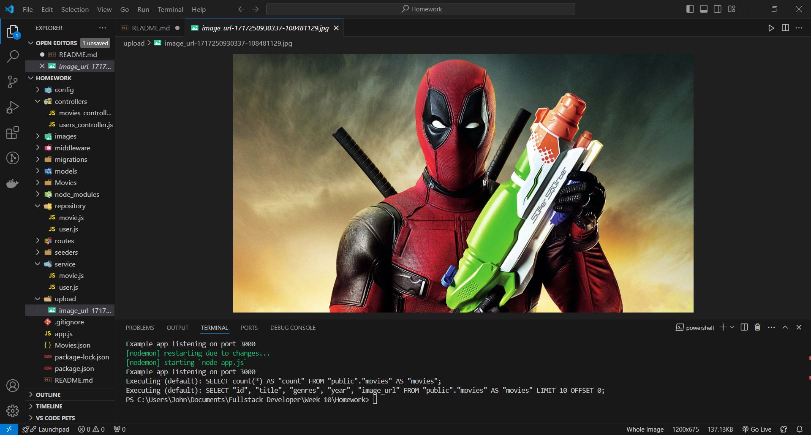

# Express JS File dan Design Pattern

## Table of contents

- [Overview](#overview)
  - [The challenge](#the-challenge)
  - [Documentation](#documentation)
  - [Links](#links)
- [My process](#my-process)

## Overview

### The challenge
- Pembuatan API untuk upload file
- Konfigurasi static file pada Express
- Penerapan design pattern

### Documentation

### Links

- Solution file: [solution_file](app.js)

## My process
- Buatlah dan susun folder-folder untuk mengikuti design pattern MVC dan Repositories
- Buatlah API CRUD pada table movies dan user
- Buatlah API upload untuk table movies dalam method POST
- Konfigurasi Express untuk serve static file

